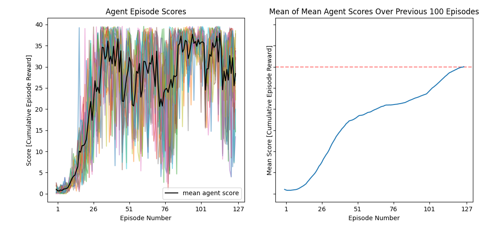

# Udacity Deep Reinforcement Learning Project 2 Version 2 Report
Robert Griffith  
31 October 2021

## Project Description

The goal of version 2 of this project was to use deep reinforcement learning  
techniques for continuous action and state spaces to learn a policy that  
provides an agent with continuous control over a double-jointed arm attempting  
to move to target locations in a provided UnityEnvironment. This Reacher  
environment is provided by Udacity and follows the architecture of the  
open-source Unity plugin **Unity Machine Learning Agents (ML-Agents)**. 
Version 2 specifically involves the use of deep reinforcement learning  
techniques that make use of multiple (non-interacting, parallel) copies of the  
same agent operating in parallel simulations to distribute the task of  
gathering experience.

In this Reacher environment, an agent is provided a reward of +0.1 for each  
timestep that the agent's "hand" is in the goal location. The state space that  
the agent perceives to perform actions in the environment has 33 dimensions and  
contains the position, rotoation, velocity, and angular velocities of the agent  
arm. Each action has 4 dimensions corresponding to torque applicable to two  
joints of the agent arm.

This task is episodic, and the environment is considered "solved" upon the mean  
earned agent score (taken over all 20 agents) averaged over 100 consecutive   
episodes being greater than or equal to +30. An individual agent "score" for an  
episode is the cumulative sum of that agent's reward from each time step in the  
episode.

In order to complete this project, not only does a deep reinforcement learning  
algorithm need to be implemented, but a myriad of hyperparameters, neural  
network model structures, and transition augmentations tailored to the Reacher  
environment need to be explored and implemented as well.

## Learning Algorithm - [Distributed Distributional Deterministic Policy Gradients (Barth-Maron et al., 2018)](https://arxiv.org/pdf/1804.08617.pdf)

I chose version 2 of this project so I could specifically apply an algorithm  
other than DDPG and challenge myself more when in the pursuit of "solving" the  
afformentioned environment (unlike in project 1 where I was content making minor  
improvements to [Deep Q-Learning (Mnih et al., 2015)](https://www.cs.toronto.edu/~vmnih/docs/dqn.pdf). For the purpose of brevity,  
the following explanations assume familiarity with Deep Q-Learning and the core  
deep reinforcement learning concepts described within its respective paper.

In pursuit of a more complex algorithm, I chose to implement D4PG, as described  
in the above-cited paper. I implemented the gradient step portions of the  
algorithm for both the actor and critic networks, as well as the application of  
random noise to the policy output within the `D4PG` class in `src/d4pq.py`. The  
experience replay buffer used to store and randomly sample weighted transitions  
(of with an arbitrary number of consecutive transitions after each sample) is  
implemented within the `ConsecutiveReplayBuffer` class in `src/replay.py`.  

To briefly summarize the D4PG algorithm, the first framework to describe is the  
relationship between "actor" and "critic" networks. An "actor" network *&pi;&theta;*, 
parameterized by traiable weights *&theta;*, produces continuous actions *a*  
from state input *s* such that *&pi;&theta;*(*s*) = *a*. This is naturally used during execution  
to produced the desired actions for a given agent. A "critic" network *Q&omega;*, 
parameterized by trainable weights *&omega;*, is usually learning an action-value  
function which takes some state *s* and executed action *a* as input and produces  
a value *V* such that *Q&omega;*(*s*, *a*) = *V*. The loss minimized to compute the gradients  
applied to *&omega;* is usually related to the difference between *V* and some recorded  
reward *r* (or set of discounted rewards *R* and also target action-value function  
*Q&omega;__'__* parameterized by trainable weights *&omega;__'__*) observed from the environment  
upon executing action *a* from state *s*. The gradients applied to *&theta;* are taken from  
minimizing the loss of -*Q&omega;*(*s*, *&pi;&theta;*(*s*)) such that the policy network is "encouraged"  
to learn to map states to actions that yield higher value *V*.

D4PG implements this classical actor-critic framework but applies an interesting  
twist to the critic network. Instead of learing to map *s* and *a* to *V*, D4PG earns its  
second D for "Distributional" by mapping *s* and *a* to a random variable such that  
the distributional action-value function *Z* can be defined in relation to *V* and *Q*  
as *Q*(*s*, *a*) = *V* = __E__ *Z*(*s*, *a*) where **E** is the expected value operator and *Z*(*s*, *a*) 
returns a distribution from *Vmin* to *Vmax*. Thus in practice we train the critic network  
*Z&omega;*, parameterized by traiable weights *&omega;*, which will have *l* output logits describing  
the *l* discrete atoms of this discretized distribution. These final output logits have  
a softmax activation function applied to them to get the probabilities of each atom,  
where *pi* is the probability at atom *i* calculated from output logit *&omega;i*. The actual  
value *vi* that atom *i* represents is then *i* * (*Vmax* - *Vmin*) / (*l* - 1).  
__E__ *Z&omega;*(*s*, *a*) is then simply calculated by __&Sigma;__*i* *pi* *vi* and used in the policy loss the same  
*Q*(*s*, *a*) is used. The loss used to calculate the gradients applied to *&omega;* however is more  
involved and is the binary cross entropy of the output *pi* probabilities from *Z&omega;*(*s*, *a*) 
and the categorical projection of the sum of a set of discounted consecutive recorded  
rewards *R* and the output *pi* probabilities of a target critic network *Z&omega;__'__*(*s*__'__, *&pi;&theta;__'__*(*s*__'__)). The  
details of the categorical projection can be found in Appendix A of the paper and  
perhaps clarified by my implementation found in `src/nn.py`. The replay buffer  
implemented in `src/replay.py` meets the functional requirements of D4PG; namely  
prioritized experience replay and the ability to sample consecutive sets of transtions  
as needed by the critic loss calculation. The gradient steps  applied to both *&theta;* and *&omega;* 
within `src/d4pg.py` are exactly as described within the paper, with the only  
modifications being that the scaling applied to the critic gradient  from the weights of  
each sample within the batch is able to be toggled, and standard practical  
augmentations like gradient norm clipping as well as weight regularization are applied.  
Polyak updates to the target actor and critic network weights, *&theta;__'__* and *&omega;__'__* respectively,  
are applied and not further discussed due to such a discussion being redundant to those  
familiar with Deep Q-Learning.

As for the "distributed" aspect of D4PG, it is arguably not a core part of the  
algorithm despite it being the first "D" in its name (which is presumably a significant  
reason why Udacity recommends D4PG be used with version 2 of this project). The  
actor and critic network architectures and gradients are not in any way related to  
there being multiple agents using copies of the actor network in parallel environments  
to collect state transition information. This use of parallel, non-interacting agents is  
seemingly applicable to all off-policy deep reinforcement learning algorithms as a  
means to more efficiently collect more state transition information, but it is described  
within this paper as an integral part of D4PG, and it is applied within my code in  
`src/train.py` (not in `src/d4pg.py` since it has nothing to do with the gradient steps  
or way the networks function).

Noise *&epsilon;* is applied to the output actions from *&pi;*(*s*) before being executed in the simulation.  
Due to all logits of the policy output being bound within [-1, 1], *&epsilon;* is applied as a scaling  
factor to a distribution from [*b*, *c*] such that -1 <= *b* <= 0 <= *c* <= 1 and the probability  
mass from [*b*, 0] equals that from [0, *c*] and for logit *ai* of action *a*, *b* = -1 - *ai* and  
*c* = 1 - *ai*.

To nearly guarantee stability and potentially improve training time, while the mean of the  
mean agent score taken over a certain number of the most recent episodes is greater than  
or equal to the required score of +30, gradient steps are not performed on either *&theta;* or *&omega;*. 
The number of episodes is configurable, and this functionality may be disabled. The ability  
to take *K* steps within the environment and record that as one state transition, as done in  
Deep Q-Learning, is also applied here. The weights (priorities or probablities) of state  
transitions inserted into the replay buffer are increased by a factor as well if that transition  
has significant reward (which in this case is any non-zero reward) in order to help aleviate  
some of the issues that an environment with sparse rewards has (as this environment does  
befor the agent can perform well at all). All of these minor training functionality  
augmentations are found in `src/train.py`.

Hyperparameter values used during the reported training run are given here:
* *K*: **1**
* *&theta;* learning rate: **0.0001**
* *&omega;* learning rate: **0.0002**
* reward discount factor *&gamma;*: **0.5**
* polyak factor *&tau;*: **0.95**
* maximum gradient norm: **1.0**
* regularization factor: **1e-5**
* buffer capacity (episodes): **1000**
* number of consecutive transitions per sample | *R* | : **5**
* number of *Z* atoms *l*: **12**
* *Vmin*: **1e-5** (avoids negative policy gradients, unlike 0)
* *Vmax*: **0.1**
* (mini) batch size: **128**
* *&epsilon;min*: **0.05**
* *&epsilon;max*: **1.0**
* *&epsilon;* decay: **0.975**
* transition priority (probability) min: **0.0001 / 128**
* transition priority (probability max: **0.01 / 128**
* transition priority decay: **0.999**
* priority reward scaling factor: **10**
* number of previous episodes checked to prevent training: **None**

The neural network architecture used for the critic and policy networks, as well as  
the target critic and policy networks, is a sequential multilayer perceptron with  
layers only consisting of "linear" layers and ReLU activation layers. The main  
difference between the two, is that the output logits from the policy networks 
*&pi;&theta;* and *&pi;&theta;__'__* have the hyperbolic tangent activation function applied to their ouput  
while the critic networks *Z&omega;* and *Z&omega;__'__* have the softmax activation function applied.  
These activation functions are only applied to the outputs of the networks during  
use in `src/d4pg.py`, so they will be omitted from the structures described below,  
which correspond to the model definitions in `src/nn.py`. 
Each linear layer is comprised of parameters "weights" *w* and "biases" *b*, where  
given an input *i* the layer outputs _w*i + b_ where the weights and the input must  
match their final and first dimensions respectively, and the biases are added  
by an elementwise broadcast along the final dimensions of _w*i_. 

The layer order for the policy networks *&pi;&theta;* and *&pi;&theta;__'__* are as follows:
* Linear layer with weights of shape (33, 128), biases of shape (128,)
* LeakyReLU activation layer (0.01 slope for x < 0)
* Linear layer with weights of shape (128, 128), biases of shape (128,)
* LeakyReLU activation layer (0.01 slope for x < 0)
* Linear layer with weights of shape (128, 4), biases of shape (4,)

The layer order for the critic networks *Z&omega;* and *Z&omega;__'__* are as follows:
* Linear layer with weights of shape (37, 256), biases of shape (256,)
* LeakyReLU activation layer (0.01 slope for x < 0)
* Linear layer with weights of shape (256, 128), biases of shape (128,)
* LeakyReLU activation layer (0.01 slope for x < 0)
* Linear layer with weights of shape (128, 4), biases of shape (*l*=12,)

## Plot of Rewards

 
It took a total of 127 episodes to "solve" the environment.  
(137 if you include 10 non-training episodes for buffer prefilling)

## Ideas for Future Work

The performance of the algorithm during training is very sensitive to the state transitions  
sampled from the replay buffer, and due to the sparse nature of the rewards at the beginning  
of training, I find that it is not uncommon for the alogrithm to struggle sometimes if given  
a "bad seed" where it does not see much reward at all and learns some initial behavior that  
is later dificult to correct, or at least makes training take longer. I would ideally like  
to apply a scaling factor to the critic and policy gradients that decreases in magnitude as  
the ratio of episodes with little to no rewards increases. Additonally, taking some of the  
temperature learning from Soft Actor Critic to encourage exploration may be a suitable  
solution as well, although it would certaily complicate the loss calculations. Something more  
simple like learning two critic networks (like Double Deep Q-Learning) may help avoid issues  
with stability, which may be a more serious issue I noticed than the training starting slower  
than I would like. These all seem like valid contributions to make to what I have produced,  
and if this near-vanilla implementation of D4PG didn't perform well enough I may have explored  
them.